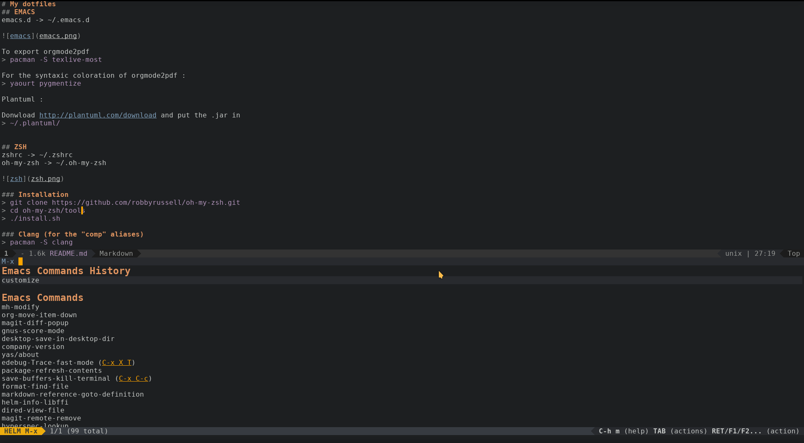
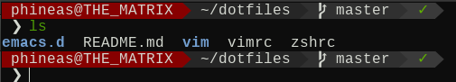
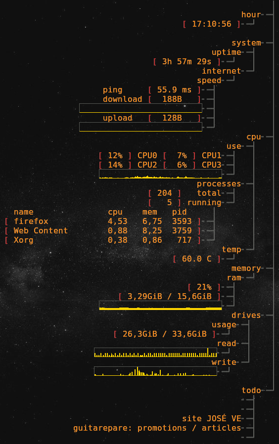
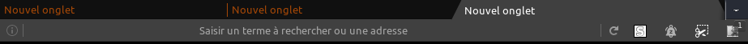

# My dotfiles
## EMACS
emacs.d -> ~/.emacs.d

To export orgmode2pdf
> pacman -S texlive-most

For the syntaxic coloration of orgmode2pdf :
> yaourt pygmentize

Plantuml :

Donwload http://plantuml.com/download and put the .jar in
> ~/.plantuml/

## ZSH
zshrc -> ~/.zshrc
oh-my-zsh -> ~/.oh-my-zsh

### Installation
> git clone https://github.com/robbyrussell/oh-my-zsh.git
> cd oh-my-zsh/tools
> ./install.sh

### Install theme (powerlevel9k)
Go to https://github.com/bhilburn/powerlevel9k/wiki/Install-Instructions and follow instructions.
=======
### Theme
The theme used here is *POWERLEVEL9K*. Don't forget to download it here :

https://github.com/bhilburn/powerlevel9k/wiki/Install-Instructions#step-1-install-powerlevel9k
>>>>>>> a803474f150db560501d5f317b0b30828d1ff096

### Clang (for the "comp" aliases)
> pacman -S clang

### Mockery
This little script replace the annoying *command not found* by fun messages ;) 
Just put the file "mockery.sh" in your HOME and rename it ".mockery.sh". Dont forget to chmod +x the script. And enjoy !

## Polybar
config/polybar -> ~/.config/polybar

### Install & run
> pacman -S polybar

> polybar top &

## Conky
Put file into your ~/.conky dir and use `conky -dc conky_left.conf &` to launch it.

## Scripts
### Copy / Paste
Place each `.sh` in a *Scripts* folder in your home, or change paths in zshrc file.
*I don't named the paste function "paste" because there are already a built-in command named "paste" and this command is useful...*

## Firefox

> !!! BETA VERSION, have some bugs

To use this *Firefox* theme, just install *stylish* : https://addons.mozilla.org/en-US/firefox/addon/stylish/?src=search.

Then, create a new userstyle, and paste the *firefox.css* content.

## Xbindkeys
First install `xbindbeys` and `xvkbd`. Then, put my *xbindkeysrc* file into your home *(~/.xbindkeysrc)* and launch *xbindkeys*.

**********************************************

## Sources
The emacs conf is based on the **wonderful** work of Louis Turpinat https://github.com/lturpinat

Firefox's theme is based on the **huytd** work: 
https://www.reddit.com/r/unixporn/comments/5vnr7d/oc_customized_firefox_theme_for_unixporners/

https://gist.github.com/huytd/9f8f1903634117f53f80e093cdacd8a1

Conky is based on the work of **Phrost5019**  https://www.reddit.com/r/unixporn/comments/4gkp8r/gnome_sea_monster/d2idtha/
